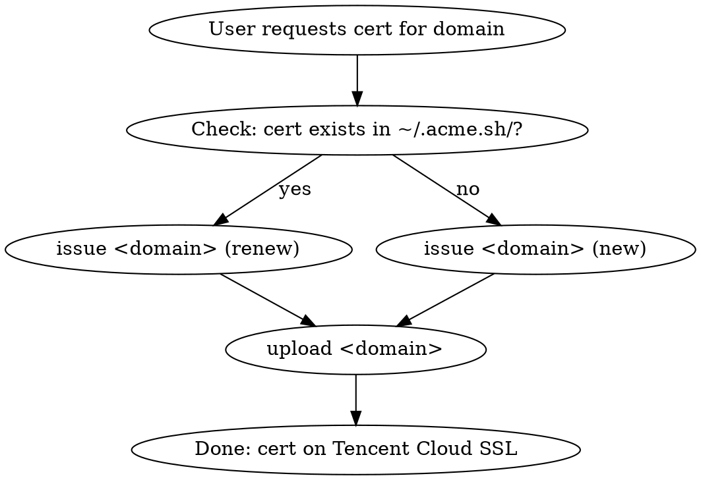

# Auto SSL QCloud

Automates SSL certificate lifecycle: issue/renew via Let's Encrypt (acme.sh) + upload to Tencent Cloud SSL service.

## Prerequisites

1. **acme.sh** installed at `~/.acme.sh/acme.sh`
2. **Python 3** with venv
3. **Tencent Cloud API credentials** in `.env`

## Setup (First Time)

```bash
cd /Users/chi/agents/codebase/auto-ssl-qcloud
python3 -m venv .venv && source .venv/bin/activate
pip install -r requirements.txt
cp .env.example .env
# Edit .env: fill in COS_SECRET_ID and COS_SECRET_KEY
```

## Commands

All commands must run with the virtual environment activated:

```bash
source .venv/bin/activate
```

### Issue or Renew a Certificate

```bash
python auto_ssl.py issue <domain>
```

Uses DNS-01 validation via Tencent Cloud DNS (`--dns dns_tencent`). If cert already exists, automatically renews instead.

### Upload Certificate to Tencent Cloud SSL

```bash
python auto_ssl.py upload <domain>
```

Reads cert/key from `~/.acme.sh/<domain>_ecc/`, uploads via Tencent Cloud SSL API. Alias: `<domain>-letsencrypt`.

### Issue + Upload (One Step)

```bash
python auto_ssl.py issue-and-upload <domain>
```

### List Managed Certificates

```bash
python auto_ssl.py list
```

Scans `~/.acme.sh/` for `*_ecc` directories.

## Workflow



## Troubleshooting

- **"COS_SECRET_ID and COS_SECRET_KEY not set"**: Edit `.env` with valid Tencent Cloud credentials.
- **"certificate files not found"**: Run `issue <domain>` first to create the cert.
- **acme.sh not found**: Install acme.sh first: `curl https://get.acme.sh | sh`
- **DNS validation fails**: Ensure acme.sh is configured with Tencent Cloud DNS API credentials (`Tencent_SecretId` / `Tencent_SecretKey` exported in shell).
